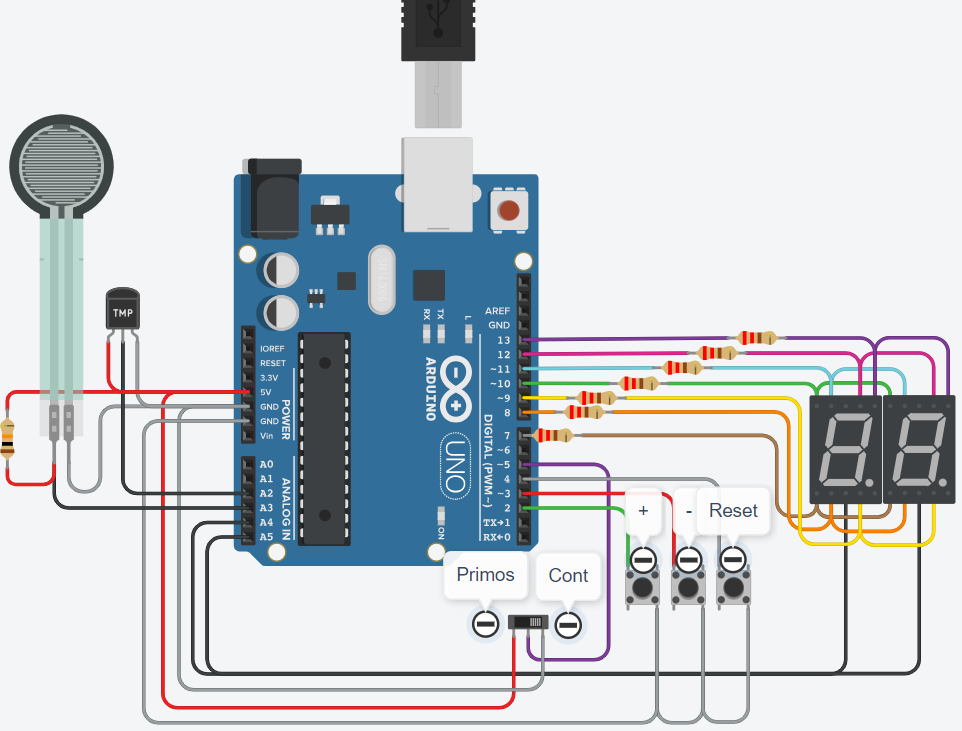
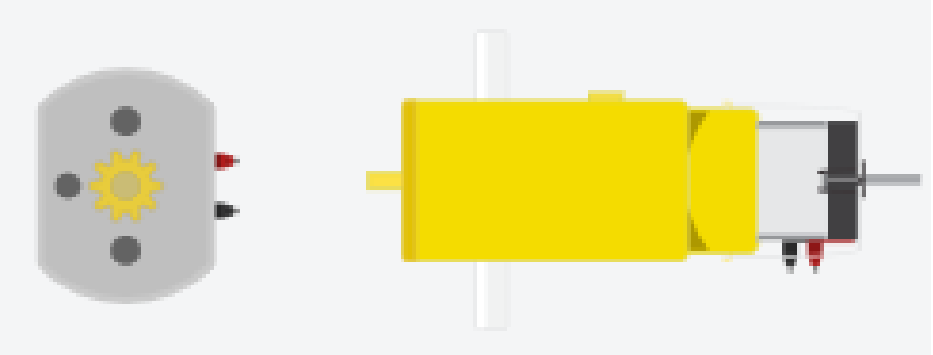
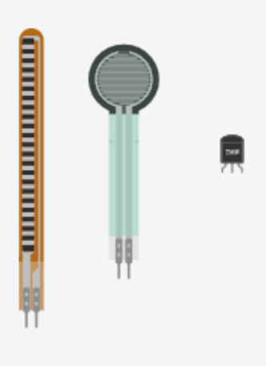

# SPD - Parcial

## Integrantes 
- Nicolas Peralta
- Hernan Nieva

## Proyecto: Contador binario.

## Descripción
En este proyecto se implementa un contador binario haciendo uso de dos displays de 7 segmentos. Se usa la técnica de multiplexado para no necesitar más pines de los que ofrece Arduino.  
Se harán uso de tres pulsadores que aumentarán, disminuirán, o resetearan el contador el pantalla. Este último tiene dos modos, uno exclusivo de números primos, y el otro, de todos los números naturales del 0 al 99.  
Los números aparecerán sólo si el sensor de temperatura supera los 70C.  
Existe la posibilidad de incrementar la cantidad de números que se avanza manipulando el sensor de fuerza.  

## Funcionalidad relevante
### Loop principal
El loop standard de arduino recibe las distintas pulsaciones a partir de la función teclaPresionada(). En base a la recepción de este valor, aumenta, disminuye, o resetea la cuenta, que luego es impresa por la función controladorDisplay():

~~~ C++
void loop() {      
  // Ejecucion del antirrebote
  int presionoTecla = teclaPresionada(); 
  int incremento = definirIncremento(analogRead(FUERZA));
  mostrarNumPrimos = digitalRead(SWITCH) == LOW;

  // Acción sobre el pulsador en base a tecla presionada
  if(presionoTecla == SUBE) {
    if(digitalRead(SWITCH) == LOW)
      contadorNumeros += 1 * incremento;
    else
      contadorNumeros = obtenerPrimo(contadorNumeros, SIGUIENTE, incremento);
   
    if(contadorNumeros > 99)
      contadorNumeros = 0;
  } else if(presionoTecla == BAJA) {
    if(digitalRead(SWITCH) == LOW)
      contadorNumeros -= 1 * incremento;
    else
      contadorNumeros = obtenerPrimo(contadorNumeros, ANTERIOR, incremento);

    if(contadorNumeros < 0)
      contadorNumeros = 99;
  } else if(presionoTecla == RESET)
     contadorNumeros = 0;
  
  // Llamamos a la funcion para el manejo de los display
  controladorDisplay(contadorNumeros);
}
~~~

### Presión de pulsador
La función teclaPresionada() está hecha de tal forma que se evite el rebote del pulsador, es decir, que el mantener apretado el botón no se detecte como varias pulsaciones seguidas. Se verifica el estado anterior del pulsador para sólo devolver cuando estuvo presionado y dejó de estarlo:

~~~ C++
int teclaPresionada(void) {
  // Función para detectar la pulsación de botones y gestionar el antirrebote.
  // Devuelve SUBE, BAJA o RESET en caso de pulsación o 0 en caso contrario.
  leerReiniciar = digitalRead(RESET);
  leerSumar = digitalRead(SUBE);
  leerRestar = digitalRead(BAJA);
  
  if(leerSumar == 1)
    sumarAnterior = 1;
  
  if(leerRestar  == 1)
    restarAnterior = 1;

  if(leerReiniciar  == 1)
    reiniciarAnterior = 1;
  
  // ANTIRREBOTE 
  if(leerSumar == 0 && leerSumar != sumarAnterior) {
  	sumarAnterior = leerSumar;
    return SUBE;
  }
  
  if(leerRestar == 0 && leerRestar != restarAnterior) {
  	restarAnterior = leerRestar;
    return BAJA;
  }
  
  if(leerReiniciar == 0 && leerReiniciar != reiniciarAnterior) {
  	reiniciarAnterior = leerReiniciar;
    return RESET;
  }

  // Devuelve 0 en caso de que no pase nada de lo anterior
  return 0;
}
~~~

## Otros componentes

### Motores

Los motores tienen la capacidad de convertir la energía eléctrica en mecánica. Esto hace que se provoque un movimiento rotatorio, por la acción de un campo magnético.
Para el proyecto, el involucrar alguno de estos motores podría traer algunas cuestiones visuales llamativas. Por ejemplo:

- Reemplazar un botón por otro que cambie el sentido de giro del motor, y que otro botón sirva para aumentar o disminuir el contador, pero en base al giro del motor.
- Hacer un contador que aumente o disminuya sin necesidad de apretar botón alguno sino que sólo en base al sentido de giro y luego de determinado tiempo.

### Sensores
  

Los sensores son entradas análogicas que, a diferencia de las digitales, devuelven valores que oscilan entre ciertos valores, particularmente entre 0 y 1023.
En el proyecto se han usado puntualmente para:

#### Temperatura

El TMP36 (componente analógico) es un sensor de temperatura que proporciona una lectura en grados centígrados de precisión y de bajo voltaje. Su rango de temperatura ronda entre -40 C a +125°C, con una precisión de ±1°C. El mismo cuenta con tres patitas para la conexión: la primera, empezando desde la izquierda, es la alimentación (5V), la del medio es la salida y la última es el pin GND.
En el proyecto, el componente fue abarcado para el uso del display.  Si el sensor está a cierta temperatura, el display se va a prender y recién ahí se va a poder ver el contador en el display, caso contrario el display no va a prender.

#### Fuerza

El sensor de fuerza es un dispositivo con el cual se puede medir una fuerza proporcional a la presión generada sobre el sensor.
En el proyecto, el dispositivo fue abarcado para el uso del contador, mediante el cual según la fuerza ejercida en el sensor cambia la velocidad a la que se suman o restan los números en el contador.

## :robot: Link al proyecto en Tinkercad
- [proyecto](https://www.tinkercad.com/things/1srGP3t4m9X)
