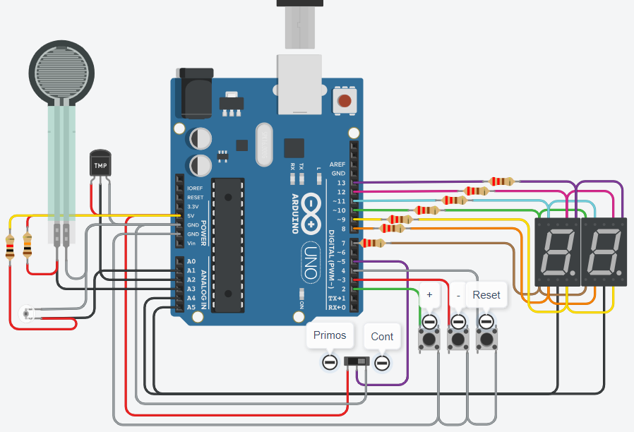

# SPD - TP1

## Integrantes 
- Lionel Prats
- Hernan Nieva

## Proyecto: Contador binario.

## Descripción
En este proyecto se implementa un contador binario haciendo uso de dos displays de 7 segmentos.
Se usa la técnica de multiplexado para no necesitar más pines de los que ofrece Arduino.

## Loop principal
El loop standard de arduino recibe las distintas pulsaciones a partir de la función press() (explicada en mayor profundidad con cometarios en el código).

En base a la recepción de este valor, aumenta, disminuye, o resetea la cuenta, que luego es impresa por la función printCount():

~~~ C++
void loop() {
  int pressed = press();
  
  if(pressed == UP) {
    countDigit ++;

    if(countDigit > 99)
      countDigit = 0;

  } else if(pressed == DOWN) {
    countDigit --;

    if(countDigit < 0)
      countDigit = 99;

  } else if(pressed == RESET)
    countDigit = 0;

  printCount(countDigit);
}
~~~

## :robot: Link al proyecto en Tinkercad
- [proyecto](https://www.tinkercad.com/things/358hSCJG9fT)